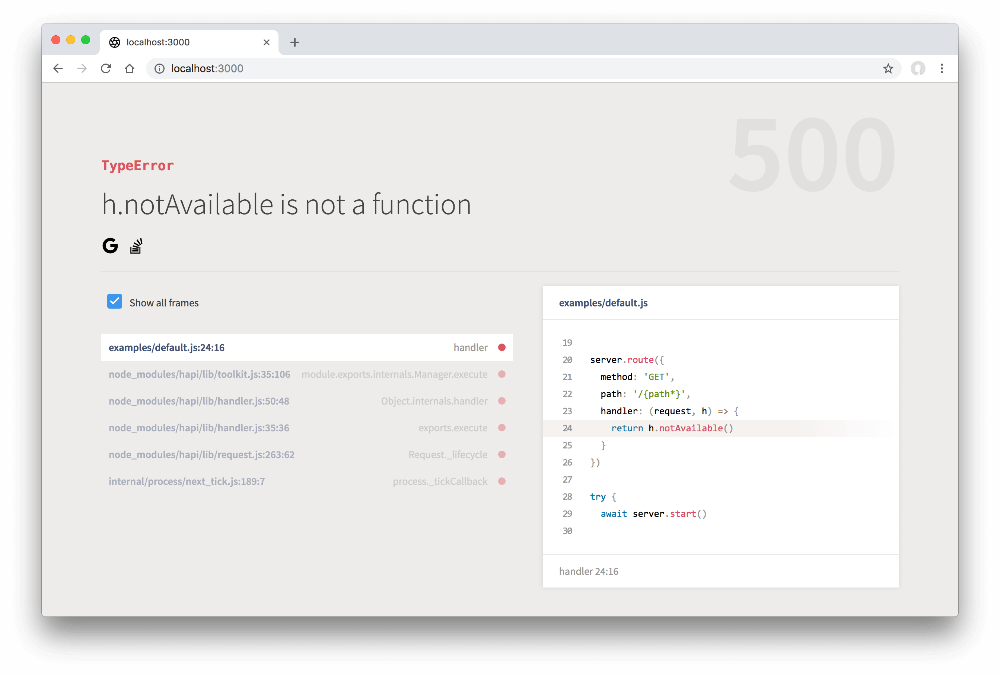

<div align="center">
  
  <br/>
  <br/>
  <p>
    A hapi plugin to show server errors in the browser or terminal.
  </p>
  <br/>
  <p>
    <a href="#installation"><strong>Installation</strong></a> ·
    <a href="#usage"><strong>Usage</strong></a> ·
    <a href="#plugin-registration-options"><strong>Plugin Options</strong></a>
  </p>
  <br/>
  <br/>
  <p>
    <a href="https://travis-ci.org/fs-opensource/hapi-dev-errors"></a>
    <a href="https://snyk.io/test/github/fs-opensource/hapi-dev-errors"></a>
    <a href="https://www.npmjs.com/package/hapi-dev-errors"></a>
  </p>
  <p>
    <em>Follow <a href="http://twitter.com/marcuspoehls">@marcuspoehls</a> for updates!</em>
  </p>
</div>

------

<p align="center"><sup>Development of this hapi plugin is supported by <a href="https://futurestud.io">Future Studio University 🚀</a></sup>
<br><b>
Join the <a href="https://futurestud.io/university">Future Studio University and Skyrocket in Node.js</a></b>
</p>

------


## Introduction
A hapi plugin to return an error view for web requests, providing more details of the issue. `hapi-dev-errors` will give you the exact file where the error happend and a nice error stacktrace within the browser. Skip the extra look at your command line to catch the issue's location.



`hapi-dev-errors` seamlessly integrates [Youch](https://github.com/poppinss/youch) to show the error details.

Besides the web view, `hapi-dev-errors` prints pretty error details to the terminal. This is nice when running your hapi server as an API. Printing error details to the console is enabled by default. To disable the terminal error, use the [`toTerminal: false` option](https://github.com/fs-opensource/hapi-dev-errors#plugin-registration-options).


## Requirements
This plugin uses async/await which requires **Node.js v8 or newer**.


## Installation
Add `hapi-dev-errors` as a dependency to your project:

```bash
# NPM 5: this way is yours
npm i hapi-dev-errors

# NPM 4:
npm i -S hapi-dev-errors
```


### Do you use hapi v16 (or lower)?
Use the `1.3.2` release of `hapi-dev-errors` with hapi v16. Later versions are only compatible with hapi v17.

```bash
# NPM 5: this way is yours
npm i hapi-dev-errors@1.3.2

# NPM 4: use NPM shortcuts to (i)nstall and (-S)ave the module as a dependency
npm i -S hapi-dev-errors@1.3.2
```


## Examples
Check out the [examples](https://github.com/fs-opensource/hapi-dev-errors/tree/master/examples) directory and get
an impression on how to configure `hapi-dev-errors` with the individual plugins options and how to customize the
error view.

## Usage
**`hapi-dev-errors` is disabled by default to avoid leaking sensitive error details during production.**

Enable the plugin by define a "truthy" value for the `showErrors` option.

The most straight forward way to register the `hapi-dev-errors` plugin:

```js
await server.register({
    plugin: require('hapi-dev-errors'),
    options: {
      showErrors: process.env.NODE_ENV !== 'production'
    }
})

// went smooth like chocolate :)
```


## Plugin Registration Options
The following plugin options allow you to customize the default behavior of `hapi-dev-errors`:

- **showErrors**: `(boolean)`, default: `false` — by default, the plugin is disabled and keeps hapi's default error handling behavior
- **template**: `(string)`, no default — provide the template name that you want to render with `h.view(template, errorData)`
- **toTerminal**: `(boolean)`, default: `true` — print pretty errors to the terminal as well (enabled by default)
- **links**: `(array)`, defaults to Google and Stack Overflow icons that are linked with the error message as the search term (enabled by default). Pass an empty array `[]` to disable the default links

```js
await server.register({
    plugin: require('hapi-dev-errors'),
    options: {
        showErrors: process.env.NODE_ENV !== 'production',
        template: 'my-error-view',
        toTerminal: true,
        links: [ (error) => {
          return `<a href="https://github.com/fs-opensource/hapi-dev-errors/search?q=${error.message}">
                    Search Youch on GitHub
                  </a>`
        }
      ]
    }
})

// went smooth like chocolate :)
```


## Provided Values for Your Custom Error View
`hapi-dev-errors` supports the `template` option while registering the plugin. Provide a template name to
use your personal error template and not the default one shipped with `hapi-dev-errors`. In case you pass a string
value for the template name, the view will be rendered with `h.view(template, errorData).code(500)`.

Available properties to use in your custom error view:

- `request`: the request that caused the error
- `error`: the error response with all its properties
- `title`: error title like `Internal Server Error`
- `statusCode`: HTTP response status code (always 500)
- `message`: error message, like `Uncaught error: h.view(...).test is not a function`
- `method`: HTTP request method, like `GET`
- `url`: URL request path, like `/signup`
- `headers`: HTTP request headers object, in key-value format
- `payload`: HTTP request payload, only available for HTTP methods other than `GET`, in key-value format
- `stacktrace`: error stacktrace


## Feature Requests
Do you miss a feature? Please don’t hesitate to
[create an issue](https://github.com/fs-opensource/hapi-dev-errors/issues) with a short description of your
desired addition to this plugin.


## Links & Resources

- [hapi tutorial series](https://futurestud.io/tutorials/hapi-get-your-server-up-and-running) with 100+ tutorials
- [Youch](https://github.com/poppinss/youch) - Pretty error reporting for Node.js
- [Youch terminal](https://github.com/poppinss/youch-terminal) - Pretty error reporting on your terminal


## Contributing

1.  Create a fork
2.  Create your feature branch: `git checkout -b my-feature`
3.  Commit your changes: `git commit -am 'Add some feature'`
4.  Push to the branch: `git push origin my-new-feature`
5.  Submit a pull request 🚀


## License

MIT © [Future Studio](https://futurestud.io)

---

> [futurestud.io](https://futurestud.io) &nbsp;&middot;&nbsp;
> GitHub [@fs-opensource](https://github.com/fs-opensource/) &nbsp;&middot;&nbsp;
> Twitter [@futurestud_io](https://twitter.com/futurestud_io)
